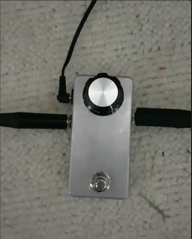

## Boost Pedal with LEDs

- Related SW project: https://github.com/cracked-machine/BoostFXPedalWithFadingLED__SW

This is a simple opamp-based gain boost circuit for guitar FX pedal.

The sockets and switches are wired directly to the board, they are not panel-mounted. This makes the design simpler but construction becomes more time-consuming. Mechanical layout for the enclosure is below.

This design went through several revisions.

- RevA is a purely analog HW design without any LEDs.
- RevC added a micro-controller to run 8 SMT LEDs in a fading pattern using PWM. RevC uses multiple SPST solid-state switches (DG467) to simplify the footswitch control and replace the bulky and expensive 3PDT mechanical switches often used in guitar FX pedals. Some high frequency signal attenuation could be heard with the DG467 switches. This is probably due to the MOSFET capacitance of the DG467 switches. However, [FFT analysis](OverdrivePedal_RevC/OverDriveSpectrumAnalysis) was inconclusive.
- RevD proposes a design to use a single DPDT Relay to avoid any signal loss issues. However, this revision was not constructed/tested.

Revision|Comments|Schema|Front|Back
:--------:|:--:|:--:|:--:|:---:
RevA|Without LEDs|[link](OverdrivePedal/docs/OverdrivePedal.pdf)|||
RevC|With LEDs, SPST SolidState|[link](OverdrivePedal_RevC/docs/OverdrivePedal_RevC.pdf)|||
RevD|With LEDs, DPDT Relay|[link](OverdrivePedal_RevD/docs/OverdrivePedal_RevD.pdf)|||

### Demo of RevC

